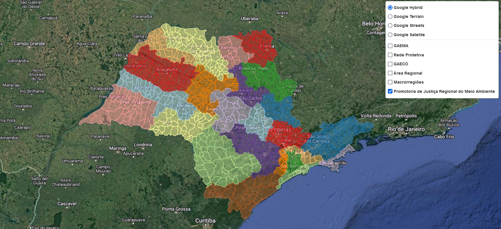

# Divisão Administrativa do MPSP

 

O presente repositório visa apresentar os _scripts_ com rotinas para atualização dos dados de divisões administrativas do Ministério Público do Estado de São Paulo, bem como criação de arquivos em diferentes formatos, bem como o mapa. São apresentadas as seguintes divisões:

- GAEMAs
- GAECOs
- Redes Protetivas
- Áreas Regionais
- Promotorias Regionais do Meio Ambiente
- Macroregiões

 

